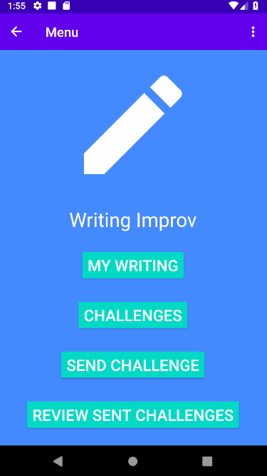
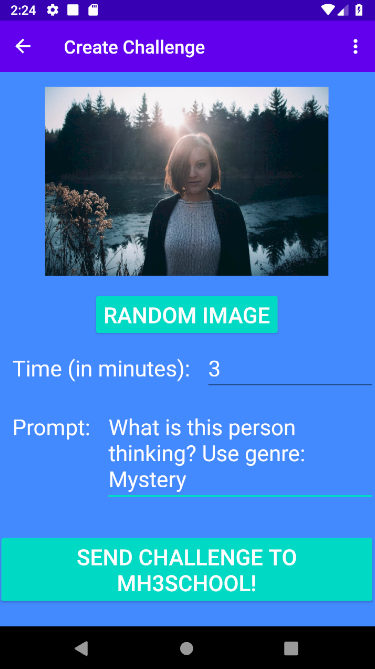
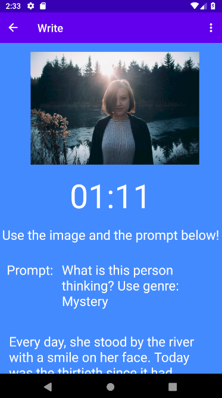
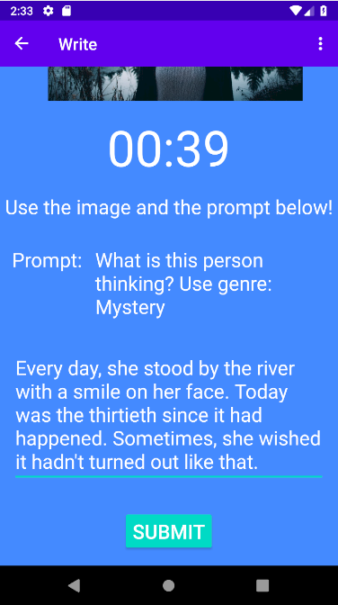
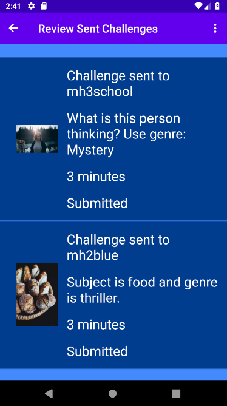
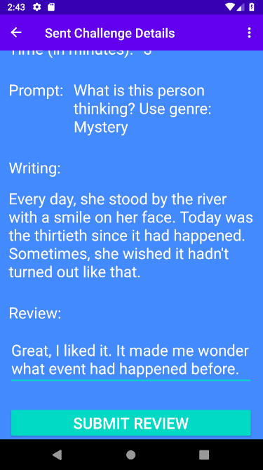
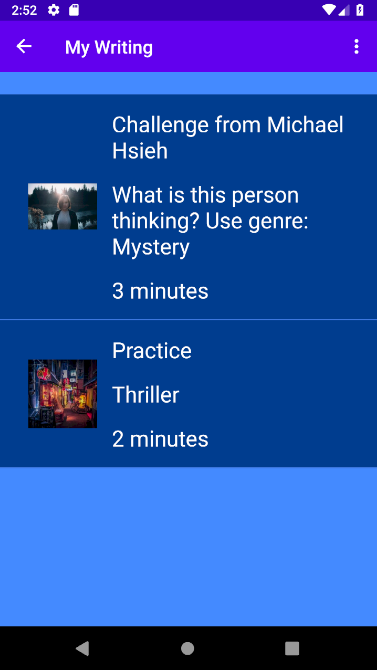

# Writing Improv
Have fun with friends and improve your creative writing skills! It's simple:
1. Pick an image and a writing prompt to send to someone.
2. They have to write about the prompt with the image before time runs out. But, they don't see the image until they start writing!
3. You review their writing to see how they did for your challenge.

## Installation
Clone this repository:
`git clone https://github.com/mdhsieh/writing-improv.git`
and open the cloned folder in Android Studio.

This app uses the Unsplash API,
so you need to [register as a developer](https://unsplash.com/join).
Login to Unsplash, create a new application, and copy the access key.
Then, create a new file `app/src/main/res/values/secrets.xml` with the access key.
For example:
```
<?xml version="1.0" encoding="utf-8"?>
<resources>
    <string name="access_key">YOUR_ACCESS_KEY</string>
</resources>
```

Run the app.

## Download
<a href='https://play.google.com/store/apps/details?id=com.michaelhsieh.writingimprov'></a>

## Features
- Automatically save your writing, challenges you receive, and challenges you send to other users in the cloud
- Send challenges to anyone else with the app
- Get notified when you receive a new challenge or others submit writing on one of your own challenges
- Review other users' writing to help them improve
- Practice on your own with random images, prompts, and a custom time limit

## Libraries
- [FirebaseUI Authentication](https://firebase.google.com/docs/auth/android/firebaseui)
- [Cloud Firestore](https://firebase.google.com/docs/firestore)
- [Retrofit](https://square.github.io/retrofit)
- [Unsplash API](https://unsplash.com/developers)
- [Toasty](https://github.com/GrenderG/Toasty)
- [Timber](https://github.com/JakeWharton/timber)

## AndroidX
- Fragment Navigation Component
- Espresso UI Testing

## Screenshots







