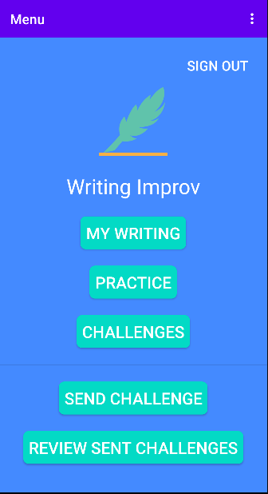
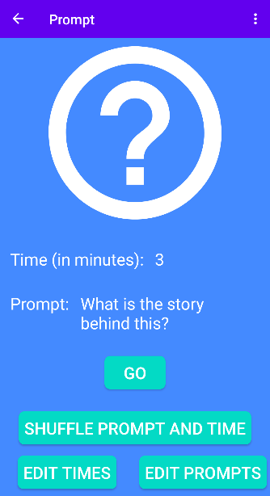
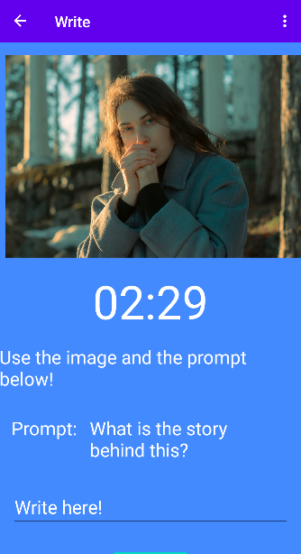
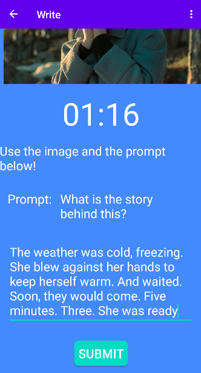
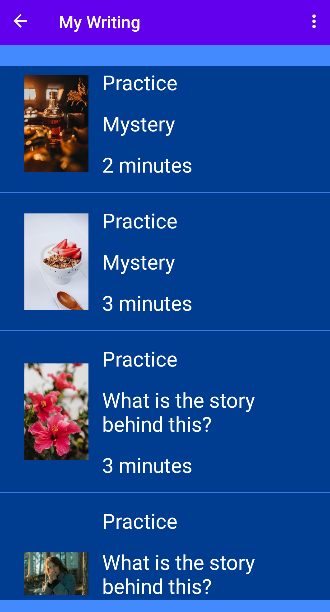
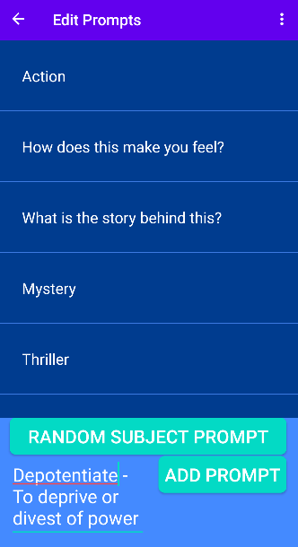
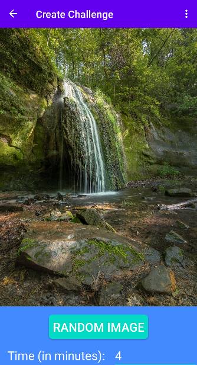
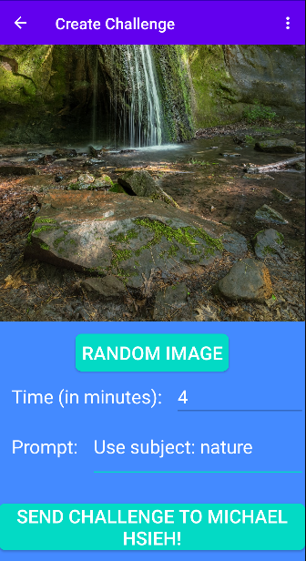

# Writing Improv
Have fun with friends and improve your creative writing skills. It's simple:

1. You get a random image and a writing prompt.
2. Write about the prompt with the image before time runs out. But, you don't see the image until you start writing.
3. You review the writing to see how you did for your challenge.

## Download
<a href='https://play.google.com/store/apps/details?id=com.michaelhsieh.writingimprov'></a>

## Features
Practice on your own:
- Write with random images, custom prompts, and a custom time limit
- Explore random subject prompts. Learn new and hard English words
- Friendly bot "writingbot" sends you a daily challenge to help you improve

Or with friends:
- Send challenges to anyone else with the app
- Get notified when you receive a new challenge or others submit writing on one of your own challenges
- Review other users' writing to help them improve
- Your writing, challenges you receive, and challenges you send to other users are automatically saved in the cloud

## Libraries
- [FirebaseUI Authentication](https://firebase.google.com/docs/auth/android/firebaseui)
- [Cloud Firestore](https://firebase.google.com/docs/firestore)
- [Retrofit](https://square.github.io/retrofit)
- [Unsplash API](https://unsplash.com/developers)
- [Toasty](https://github.com/GrenderG/Toasty)
- [Timber](https://github.com/JakeWharton/timber)
- [Random Words API](https://github.com/mcnaveen/Random-Words-API)

## AndroidX
- Fragment Navigation Component
- Espresso UI Testing

## Developer Installation
Clone this repository:
`git clone https://github.com/mdhsieh/writing-improv.git`
and open the cloned folder in Android Studio.

This app uses Google Firebase.
Follow [these instructions](https://firebase.google.com/docs/android/setup) to register your app with Firebase.
Then download your config file `google-services.json` and move the file into the module (app-level) directory of your app.

This app uses the Unsplash API,
so you need to [register as a developer](https://unsplash.com/join).
Login to Unsplash, create a new application, and copy the access key.
Then, create a new file `app/src/main/res/values/secrets.xml` with the access key.
For example:
```
<?xml version="1.0" encoding="utf-8"?>
<resources>
    <string name="access_key">YOUR_ACCESS_KEY</string>
</resources>
```

In the new file, add a test email, password, and a bot account email string. For example:
```
<?xml version="1.0" encoding="utf-8"?>
<resources>
    <string name="access_key">YOUR_ACCESS_KEY</string>
    <string name="test_email">YOUR_FIRESTORE_USER_ACCOUNT_EMAIL</string>
    <string name="test_password">YOUR_FIRESTORE_USER_ACCOUNT_PASSWORD</string>
    <string name="bot_email">BOT_ACCOUNT_EMAIL</string>
</resources>
```
The bot, which sends a daily challenge to users, needs an account email also.

Finally, delete this app `build.gradle` block:
```
signingConfigs {
    // signing credentials here
{
```
and in Android Studio set the build variant to `debug`.

Sync gradle file and run the app.

## Screenshots








