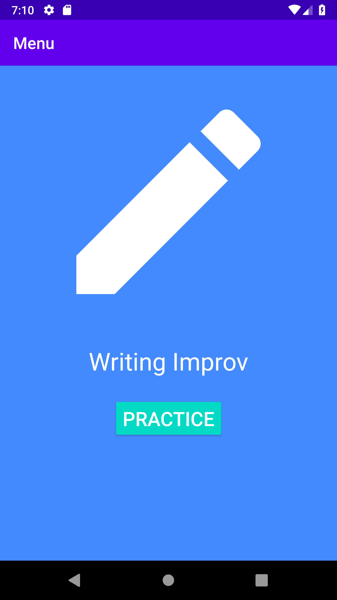
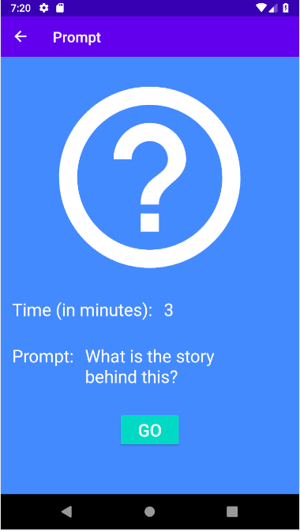
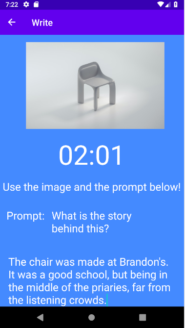
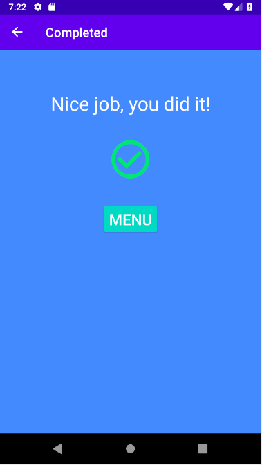

# Writing Improv
Improve your creative writing skills.

## Installation
Clone this repository, open the cloned folder in Android Studio, and run the app.

## Download

## Features

## Libraries
- [Unsplash API](https://unsplash.com/developers)
- [Toasty](https://github.com/GrenderG/Toasty)
- [Timber](https://github.com/JakeWharton/timber)

## AndroidX
- Fragment Navigation Component
- Espresso UI Testing

## Screenshots

